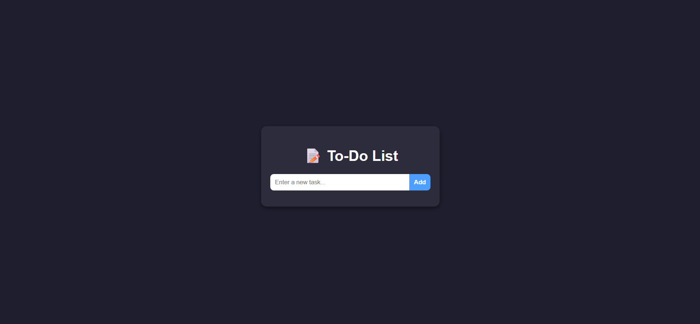
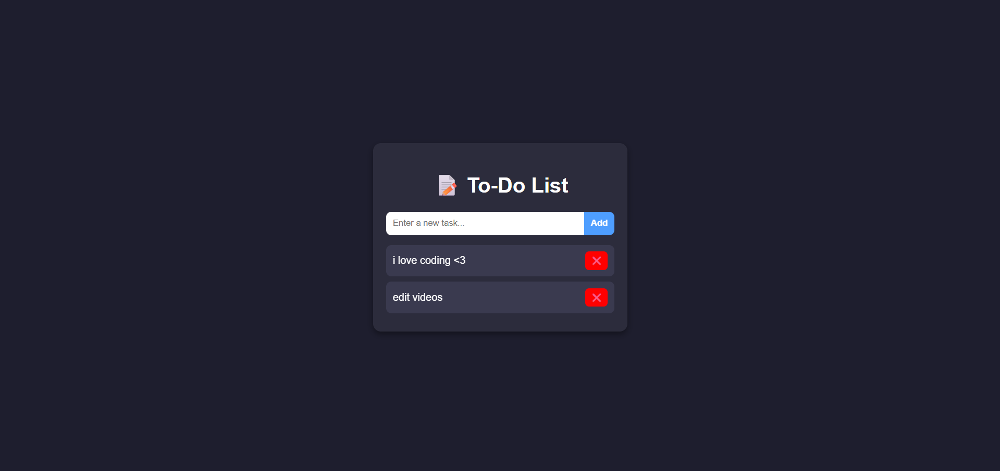
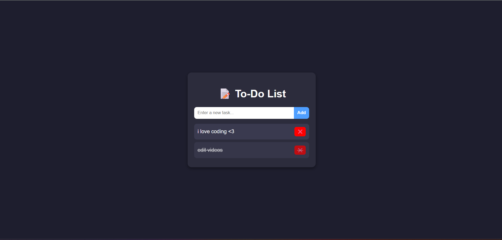

<h1 align="center">📝 To-Do List App</h1>

<p align="center">
  A simple and elegant To-Do List application to manage your daily tasks efficiently.  
</p>

---

## ✨ Features
- ➕ Add new tasks easily  
- ✅ Mark tasks as completed  
- ❌ Delete tasks you don’t need  
- 💾 Data persistence (save tasks)  
- 📱 Responsive & clean UI  

---

## 🚀 Getting Started

### 1. Clone the Repository
```bash
git clone https://github.com/your-username/todo-list.git
cd todo-list
```
2. Open in Browser

Just open the index.html file in your browser to start using the app.
---

## 📸 Demo

<p align="center">   </p>
<p align="center">  </p>

---
## 🛠 Tech Stack :

 - HTML5
 - CSS3
 - JavaScript

---

## 🤝 Contributing

Contributions, issues, and feature requests are welcome!
Feel free to fork this repo and submit a PR.

---
## 📜 License

This project is open-source under the MIT License.
